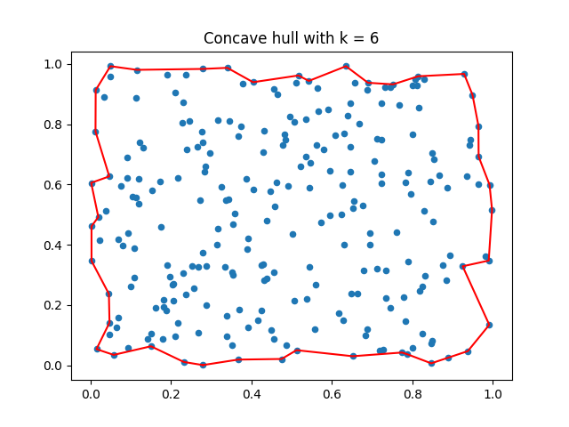
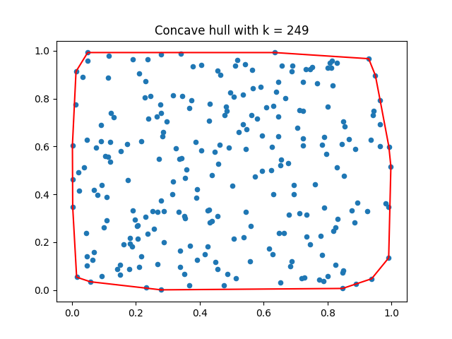

# concave-hull-python

## Outline

Python implementation of the "concave hull" algorithm from the paper:

Moreira, A., & Santos, M. Y. (2007). Concave hull: A k-nearest neighbours approach for the computation of the region occupied by a set of points.
(https://repositorium.sdum.uminho.pt/handle/1822/6429)

## Dependencies
- Numpy
- Matplotlib (for included test script)

## Details

Note that in Section 3.1 of the paper, the authors describe the next selected hull point as being the point that "results in the largest right-hand turn, corresponding to the largest angle between the previous line segment and the candidate line segment".

In this implementation left-hand turns are measured instead of right-hand turns.
Therefore, instead of maximising right-hand turn angles, left-hand turn angles are minimised (the two objectives are equivalent since both angles must sum to 360 degrees).

## Examples

Below is the output of running the included `test_convcave_hull.py` script.
The dataset for this example is a random set of 250 points in the unit square.

_Output 1: Finding the hull with automatically determined smallest valid k value._

_Output 2: Finding the hull with the largest possible k value - which also happens to be the convex hull!_

## Remarks
- Some effort has been made to minimise the amount of computation done in the algorithm via initially pre-computing the distance matrix and pre-sorting the nearest neighbours for each point to make k-NN queries run in constant time.
- The code has only been tested on small toy datasets (order of magnitude 10k points and below), where it seems to perform OK.
- For larger datasets it may not be feasible to store the sorted neighbour map in memory.
